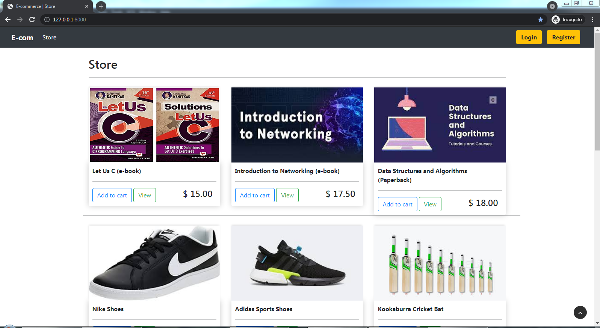
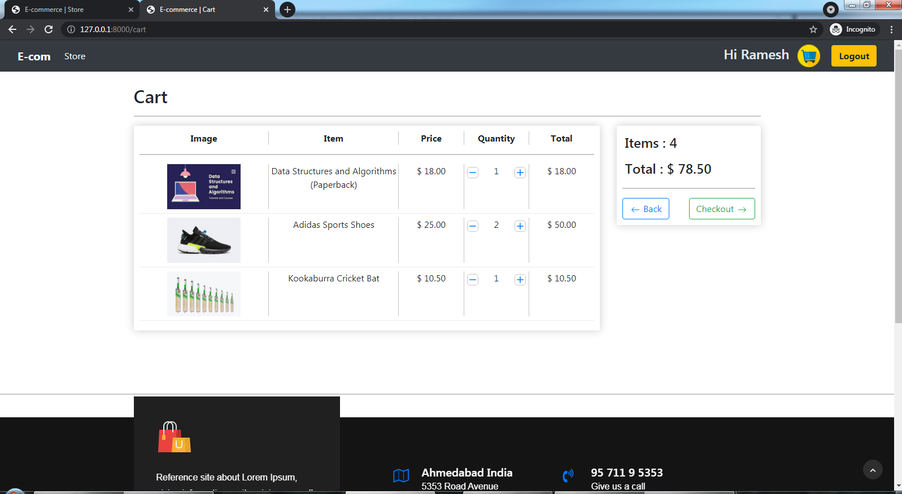
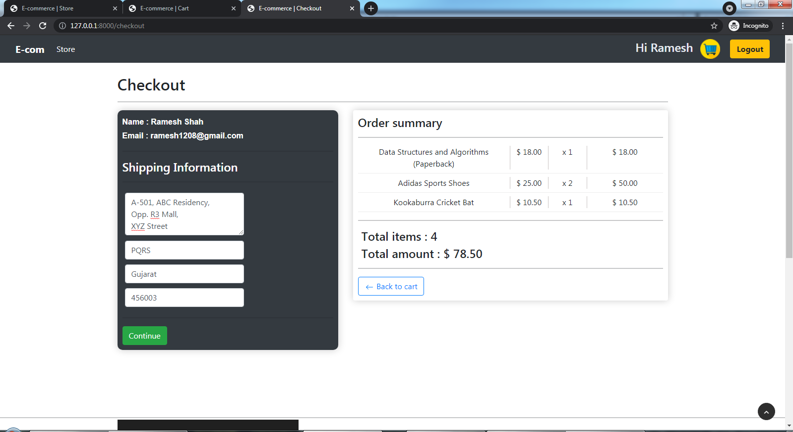
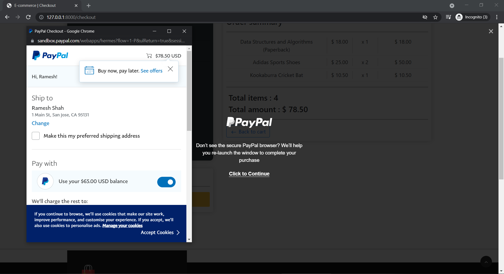
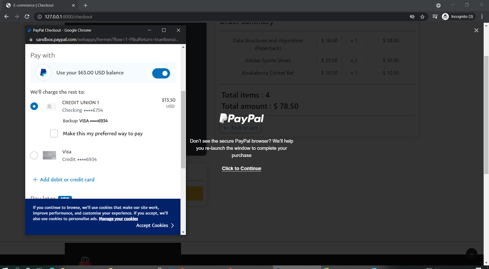

# basic-e-com
Customer side implementation of an e-commerce website with dummy payment gateway integration.

The project is implemented using Django and Javascript. PayPal payment gateway is integrated to make transactions using dummy accounts.

